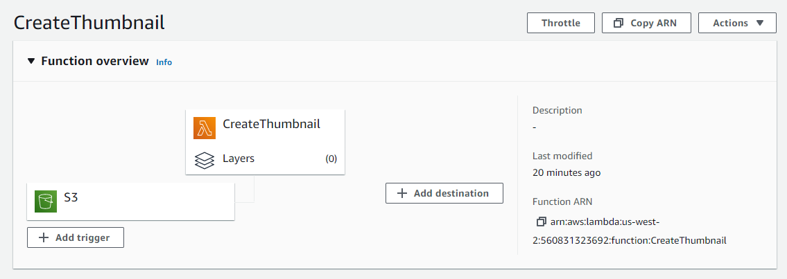
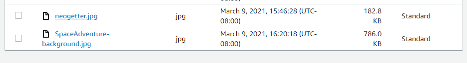
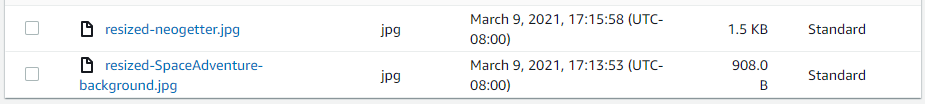

# AWS-S3-and-Lambda
---

## Overview

AWS Lambda allows writing code that is triggered in the cloud, without thinking about maintaining servers. We’ll use it today to automatically run some processing on image files after they’re uploaded to an S3 Bucket

## Author: William Moreno

## Deployment

The 'CreateThumbnail' successfully resizes .jpg and .png files that are uploaded into the `401imagebucket` S3 bucket and moves the thumbnail version into the `401imagebucket-resized` S3 bucket. 

### 401imagebucket

### 401imagebucket-resized

## Process

This labwork was largely influenced by the AWS tutorial: [*"Using AWS Lambda with Amazon S3"*](https://docs.aws.amazon.com/lambda/latest/dg/with-s3-example.html)

I encountered issues that I eventually determined stemmed from installing the incorrect version of `sharp` at the onset. After removing and replacing the package with the correct one, everything worked correctly.

